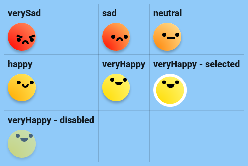
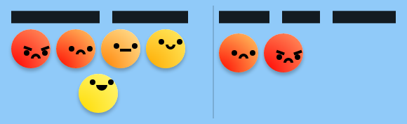

# smiley_ui

Implementation of BastiUi design in Flutter. (Inspired by [Aloïs Deniel implementation](https://twitter.com/aloisdeniel/status/1518564668935217153))

(I might make a package out of it at some point)


[Try the demo](https://rouxguillau.me/bastiui_smileys/#/)

# Getting started

Add the package by adding the following to your pubspec.yaml:

```yaml
smiley_ui:
  git:
    url: https://github.com/TesteurManiak/bastiui_smileys.git
```

# Widgets & Methods

## [`SmileyWidget`](lib/src/smiley_widget.dart)

Base widget which draws an animated smiley.


### Code Sample

```dart
SmileyWidget(
    expression: SmileyExpression.happy,
);
```

### Screenshot



## [`SmileysSelection`](lib/src/smileys_selection.dart)

Widget which displays a list of smileys and allows selection. You can use the argument `expressions` to specify which smileys to display.

### Code Sample

```dart
SmileysSelection();
```

### Screenshot



## [`SmileyBottomSheet`](lib/src/smileys_bottom_sheet.dart)

Bottom sheet which contains the `SmileysSelection` widget. You can also display this widget with the method `showSmileysBottomSheet`.

### Code Sample

```dart
SmileyBottomSheet();

showSmileysBottomSheet(context);
```

### Screenshot


## [`SmileysDialog`](lib/src/smileys_dialog.dart)

Dialog which contains the `SmileysSelection` widget.

* You can also display this widget with the method `showSmileysDialog`.
* Supported parameters: `title`, `submitButtonText`, `cancelButtonText`, `submitButtonStyle` and `cancelButtonStyle`.

### Code Sample

```dart
SmileysDialog();

showSmileysDialog(context);
```

### Screenshot


## Credits

* [BastiUi video](https://youtu.be/NIz7EiyunmY)
* [BastiUi Figma](https://www.figma.com/community/file/1095723917861848844)
* [Aloïs Deniel video](https://youtu.be/JJv-8lF_xAA)
