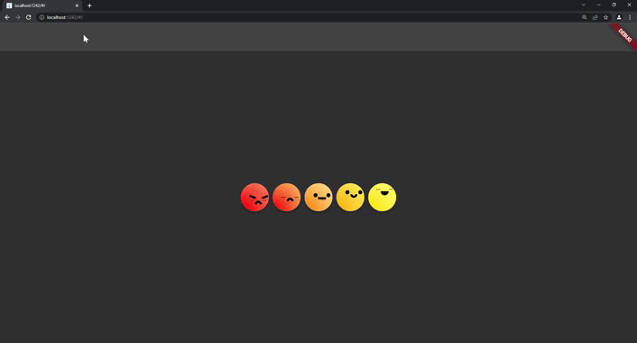
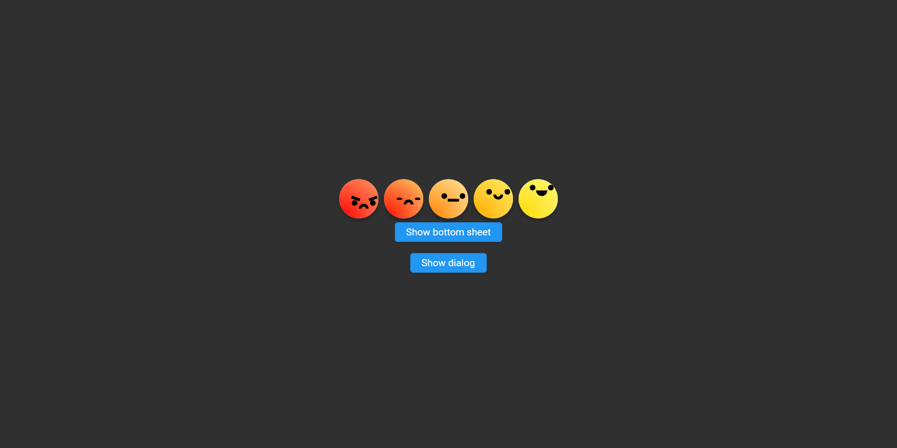
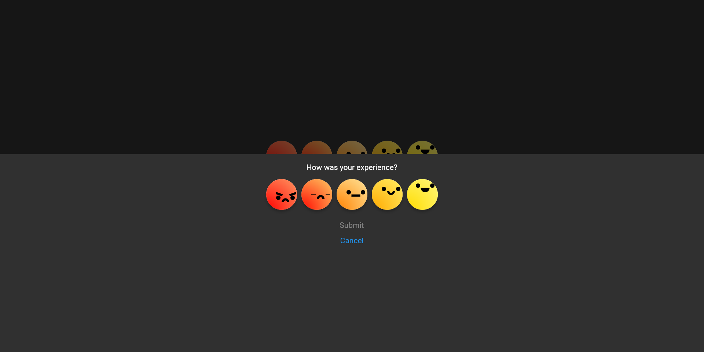
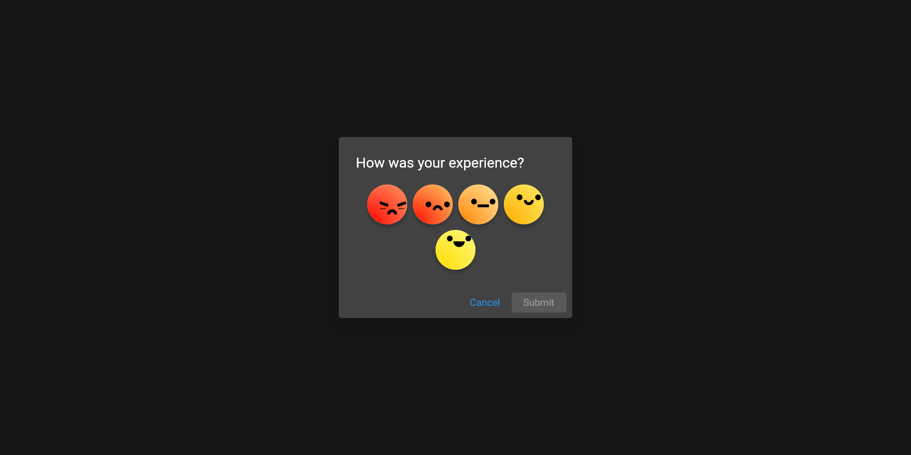

# bastiui_smileys

Implementation of BastiUi design in Flutter. (Inspired by [Aloïs Deniel implementation](https://twitter.com/aloisdeniel/status/1518564668935217153))

(I might make a package out of it at some point)



## Widgets & Methods

* [`SmileyWidget`](lib/challenge/smiley_widget.dart): Base widget which draws an animated smiley.

```dart
SmileyWidget(
    expression: SmileyExpression.happy,
);
```

* [`SmileysSelection`](lib/challenge/smileys_selection.dart): Widget which displays a list of smileys and allows selection.

```dart
SmileysSelection();
```



* [`SmileyBottomSheet`](lib/challenge/smileys_bottom_sheet.dart): Bottom sheet which contains the `SmileysSelection` widget.
    * You can also display this widget with the method `showSmileysBottomSheet`.

```dart
SmileyBottomSheet();

showSmileysBottomSheet(context);
```



* [`SmileysDialog`](lib/challenge/smileys_dialog.dart): Dialog which contains the `SmileysSelection` widget.
    * You can also display this widget with the method `showSmileysDialog`.
    * Supported parameters: `title`, `submitButtonText`, `cancelButtonText`, `submitButtonStyle` and `cancelButtonStyle`.

```dart
SmileysDialog();

showSmileysDialog(context);
```



## Credits

* [BastiUi video](https://youtu.be/NIz7EiyunmY)
* [BastiUi Figma](https://www.figma.com/community/file/1095723917861848844)
* [Aloïs Deniel video](https://youtu.be/JJv-8lF_xAA)
