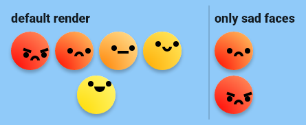

# smiley_ui

Implementation of BastiUi design in Flutter. (Inspired by [Aloïs Deniel implementation](https://twitter.com/aloisdeniel/status/1518564668935217153))


[Try the demo](https://rouxguillau.me/bastiui_smileys/#/)

# Getting started

For now this package is not available on pub.dev so, you can add the package by adding the following to your pubspec.yaml:

```yaml
smiley_ui:
  git:
    url: https://github.com/TesteurManiak/bastiui_smileys.git
    ref: main # Optional, use it if you want a specific branch or tag.
```

# Widgets & Methods

## [`SmileyWidget`](lib/src/smiley_widget.dart)

Base widget which draws an animated smiley.

### Code Sample

```dart
SmileyWidget(
    expression: SmileyExpression.happy,
);
```

### Screenshot


### Supported Parameters

* `expression`: The expression of the smiley.
* `isSelected`: Selection state of the smiley.
* `isEnabled`: Define if the widget is enabled or not. (Manage the opacity on the widget)
* `onTap`: Callback when the widget is tapped on.

## [`SmileysSelection`](lib/src/smileys_selection.dart)

Widget which displays a list of smileys and allows selection.

### Code Sample

```dart
SmileysSelection();
```

### Screenshot



### Supported Parameters

* `expressions`: List of smiley expressions to display.
* `onSmileySelected`: Callback triggered when the user selects or unselect a smiley.

## [`SmileyBottomSheet`](lib/src/smileys_bottom_sheet.dart)

Bottom sheet which contains the `SmileysSelection` widget.

### Code Sample

```dart
SmileyBottomSheet();

// Or use
showSmileysBottomSheet(context);
```

### Screenshot


## [`SmileysDialog`](lib/src/smileys_dialog.dart)

Dialog which contains the `SmileysSelection` widget.

### Code Sample

```dart
SmileysDialog();

// Or use
showSmileysDialog(context);
```

### Screenshot


### Supported Parameters

* `title`: Title of the dialog.
* `submitButtonText`: Text of the submit button.
* `cancelButtonText`: Text of the cancel button.
* `submitButtonStyle`: Style of the submit button.
* `cancelButtonStyle`: Style of the cancel button.

## Credits

* [BastiUi video](https://youtu.be/NIz7EiyunmY)
* [BastiUi Figma](https://www.figma.com/community/file/1095723917861848844)
* [Aloïs Deniel video](https://youtu.be/JJv-8lF_xAA)
